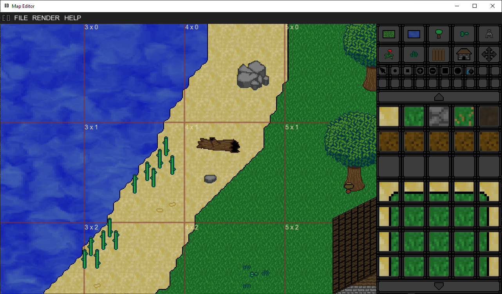
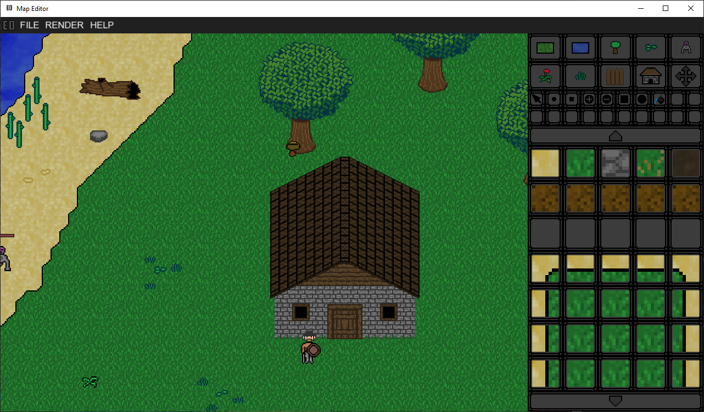
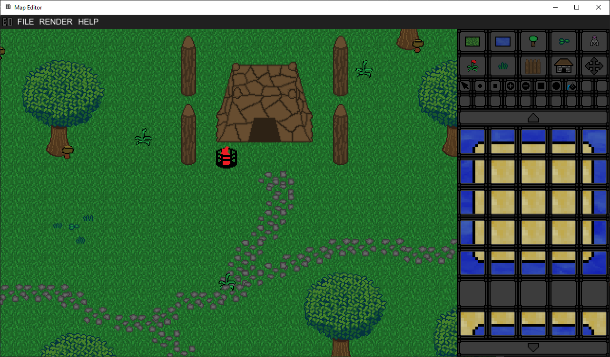
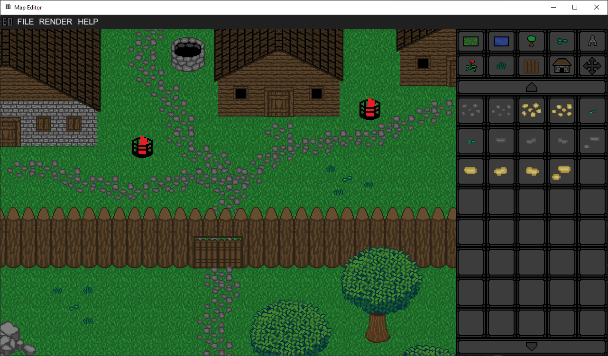
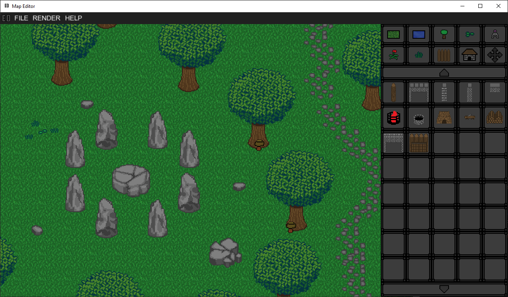
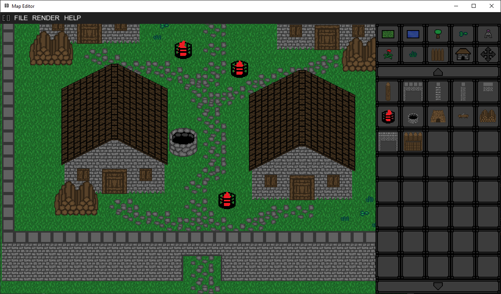
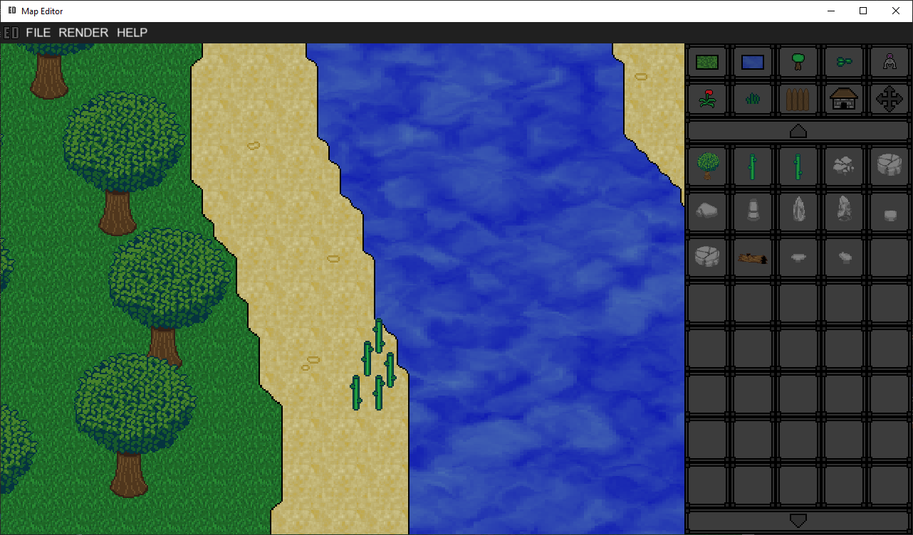

#Editor RPG2D

## Spis treści
- [Opis](#opis)
- [Zrzuty ekranu](#zrzuty-ekranu)
- [Technologie](#technologie)

## Opis
**Editor RPG2D** to prosty, ale rozbudowany edytor, który pozwala tworzyć gry RPG 2D. Program umożliwia tworzenie map, dodawanie do nich obiektów, budynków oraz characterów, a także tworzenie systemu dialogów oraz zadań.

## Zrzuty ekranu

## Technologie
Program stworzono w języku C++ z wykorzystaniem biblioteki SFML 2.6.2.