#Editor RPG2D

## Spis treści
- [Opis](#opis)
- [Zrzuty ekranu](#zrzuty-ekranu)
- [Technologie](#technologie)
- [Licencja](#licencja)

## Opis
**Editor RPG2D** to prosty, ale rozbudowany edytor, który pozwala tworzyć gry RPG 2D. Program umożliwia tworzenie map, dodawanie do nich obiektów, budynków oraz characterów, a także tworzenie systemu dialogów oraz zadań.

## Zrzuty ekranu
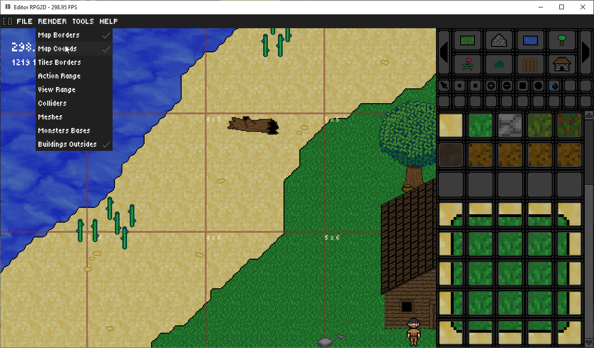
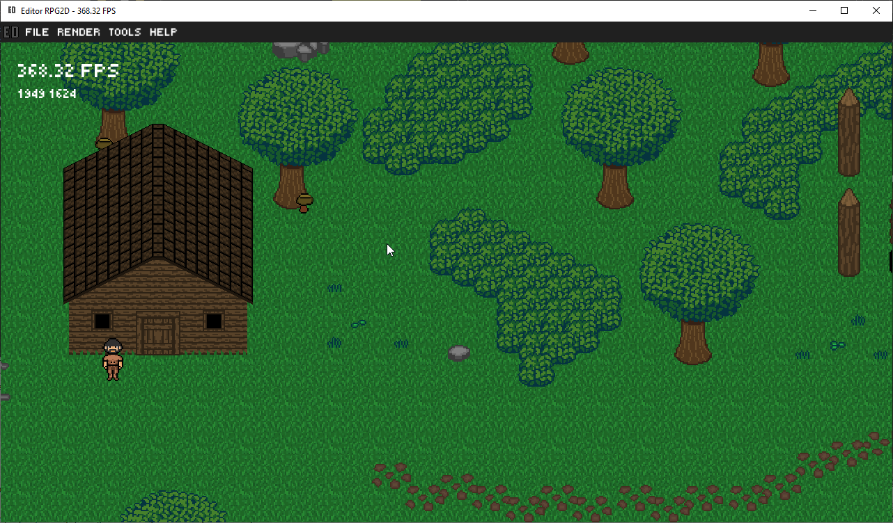
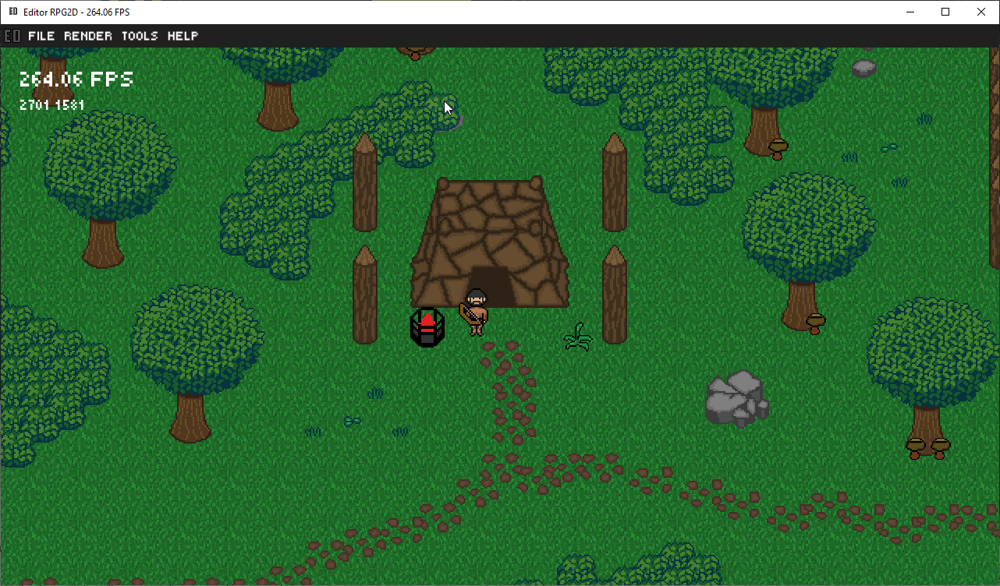
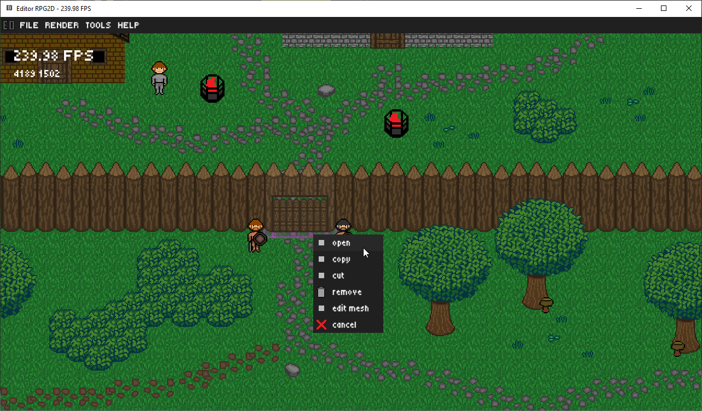
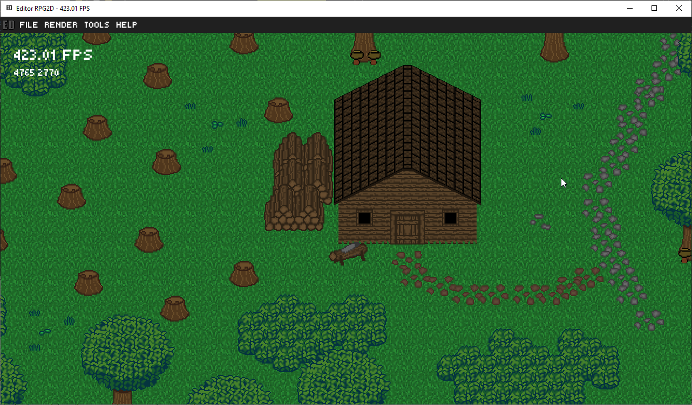
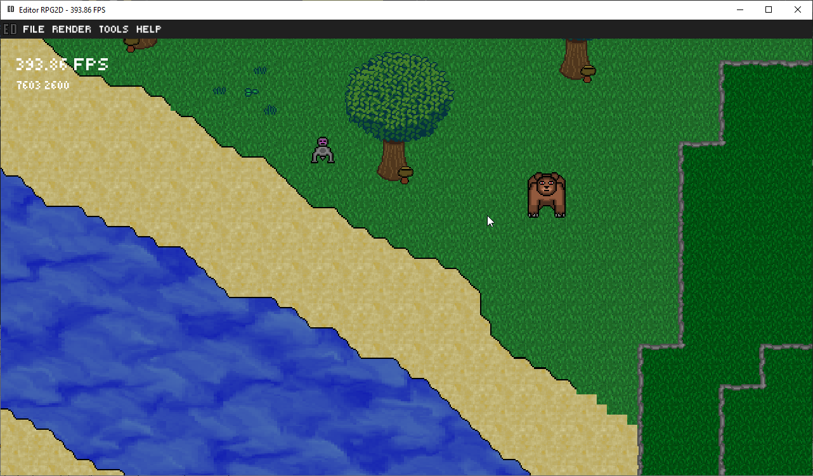
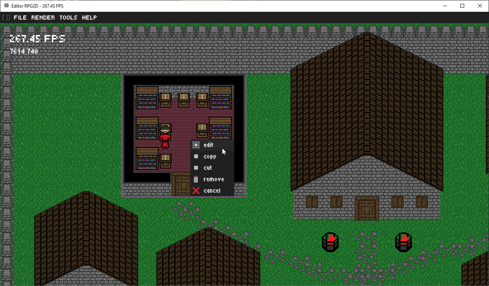
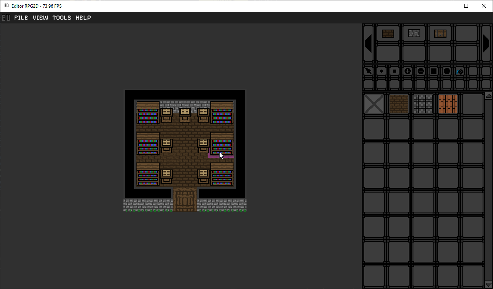
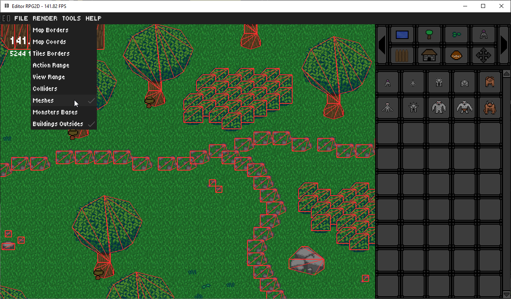
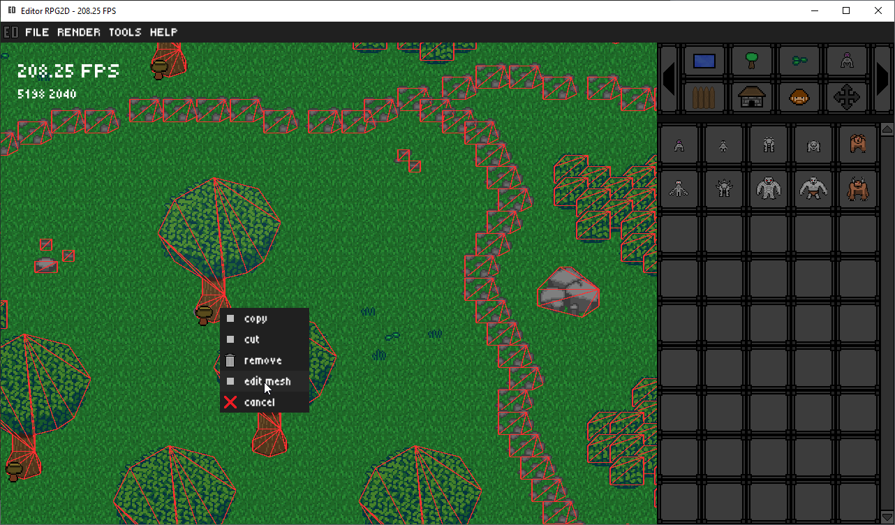

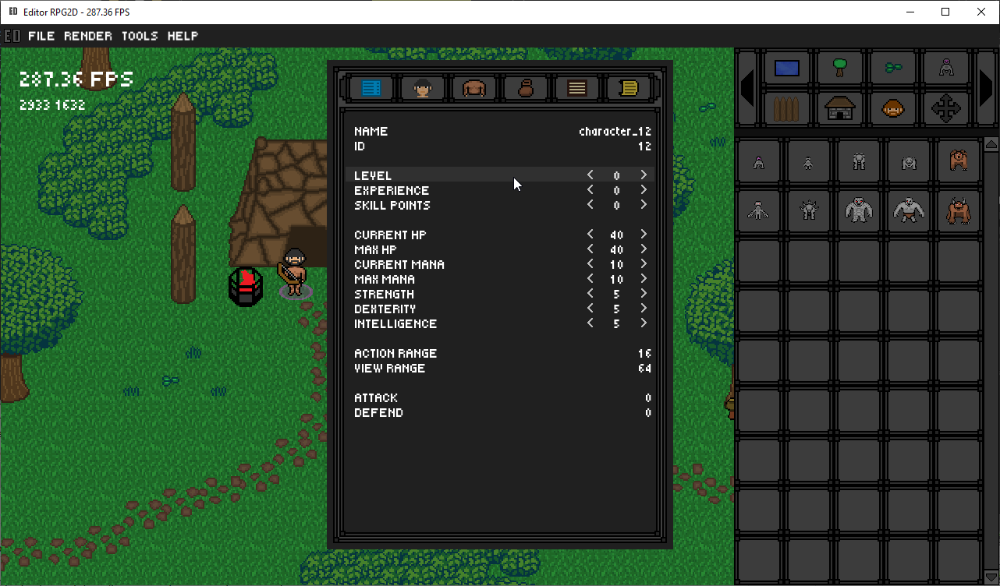
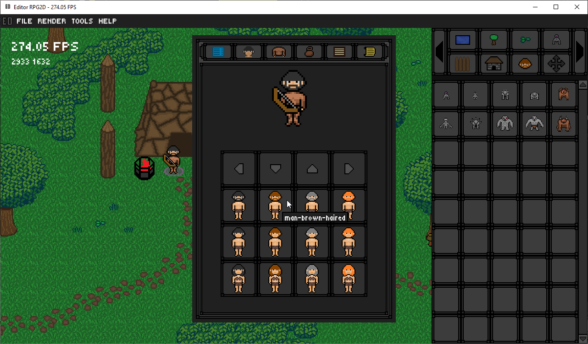
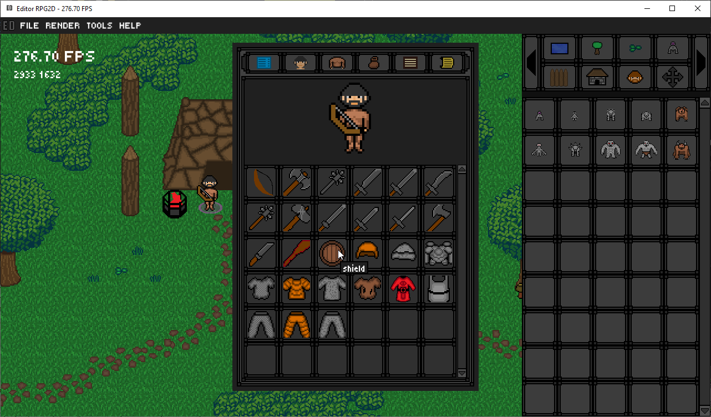
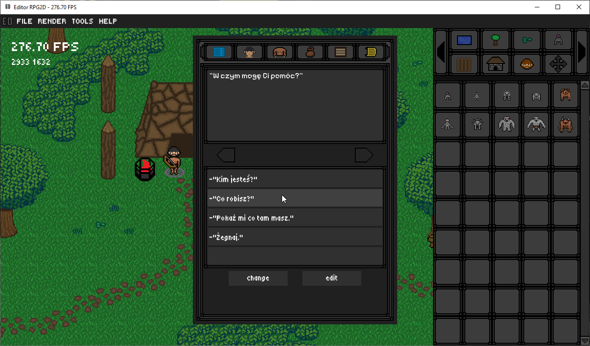

## Technologie
Program stworzono w języku C++ z wykorzystaniem biblioteki SFML 2.6.2.  
  
## Licenja
Licencja Otwarta – Uznanie autorstwa  
  
Ten program może być:  
-Pobierany  
-Kopiowany  
-Modyfikowany  
-Wykorzystywany w projektach prywatnych i komercyjnych  
  
Pod warunkiem, że:  
-Zachowana zostanie informacja o autorze oryginalnego programu  
-Podane zostanie źródło (link do repozytorium)  
-W przypadku modyfikacji, należy wyraźnie zaznaczyć, że program został zmodyfikowany oraz przez kogo.  